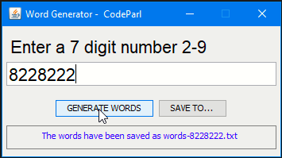

# Telephone Number Word Generator

## screenshot

## About this code

Standard telephone keypads contain the digits zero through nine. The numbers two through nine each have three letters associated with them. Many people find it difficult to memorize phone numbers, so they use the correspondence between digits and letters to develop seven-letter words that correspond to their phone numbers. For example, a person whose telephone number is 686-2377 might use the correspondence of "686-2377"  to develop the seven-letter word "NUMBERS". Every seven-letter word corresponds to exactly one seven-digit telephone number. A restaurant wishing to increase its takeout business could surely do so with the number 825-3688 ("TAKEOUT").

Write a program that, given a seven-digit number, uses a PrintStream object to write to a file every possible seven-letter word combination corresponding to that number. There are 2,187 (37) such combinations. Avoid phone numbers with the digits 0 and 1.

## How to run this code

To run this code example, simply download the [jdk](https://www.oracle.com/java/technologies/javase-jdk16-downloads.html)  from oracle website and install it on your machine, then install [VSCode](https://code.visualstudio.com/download) and install it, then open the code example in VSCode. You must install java extension before working with this code example in VSCode.

## Author

This code example was writted by [Hassan Mugabo - aka Codeparl](https://github.com/codeparl)

## More code examples

For more code examples, please checkout [codeparl.com](https://codeparl.com)

## License

Licensed under MIT (https://github.com/codeparl/Telephone-Number-Word-Generator/blob/master/LICENSE)